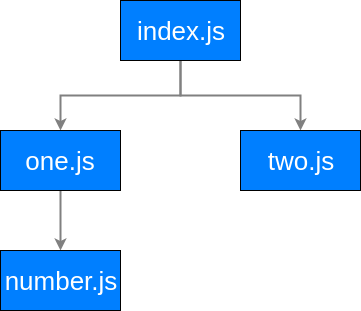
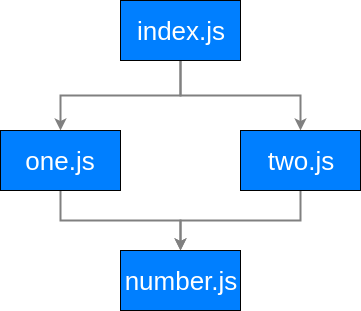

# How Does Rollup Find Modules?

You can think about your project being a graph, where each module in your project is a node.

You start with your entry file (specified by your configuration, which we will cover later):

```js
// index.js
import one from './one.js';
import two from './two.js';

console.log(one + two);
```

As we covered in the previous gudie, Rollup creates `Module` objects by reading the contents of a file and parsing it into an abstract syntax tree (AST)and analyzing all of the ndoes in the AST.

As a result of the analysis, our `Module` objects each have an array of `source` files..

```js
import x from './x';
import * as y from './y';
import { z1, z2 } from './z';
export { a } from './a';
// sources = ['./x', './y', './z', './a']
```

In our `index.js` module, we have two import nodes: one for the `./one.js` file and the second for the './two.js' file.

```js
import one from './one.js'; // first import
import two from './two.js'; // second import
```

Given the above code, the associated `Module` will have two sources: `./one.js` and `./two.js`. For each one, Rollup will create a `Module` object and analyze its code. Let's take a look at what the content of those files looks like.

```js
// one.js
import Number from './number.js';

export default Number(1);
```

```js
// two.js
export default 2;
```

We see that `one.js` has an import of `number.js` while `two.js` has no imports. Rollup will iterate over a module's sources in the order they are found, so from our `index.js` module, it will start with the `one.js` import. A `Module` will be created for `one.js` and Rollup will see that it imports `number.js`.

Now, we know that we have two sources that haven't been parsed and analyzed: `two.js` and `number.js`. Which one will Rollup read next? Rollup does a depth first traversal, always creating `Module`s for child sources of the current module before moving on to the current module's siblings. This means that Rollup will create a `Module` for `number.js` next.

```js
// number.js
export default function(n) {
  return n;
}
```

After createing a `Module` from the `number.js` file and analyzing it, Rollup will see that it has no import nodes. Rollup will then go back to its parent module, `one.js`. `one.js` only had the single import, so it too will go back to its parent module, `index.js`. Now that we have finished importing the `one.js` chain of modules, Rollup will move on to the second import in the `index.js` file, `two.js`. Rollup will read and parse `two.js` and see that it has no imports. Finally, Rollup returns to our entry module `index.js` and see that it has no more imports, so our module graph is complete.



That graph is a tree, but if we were to modify `two.js` to also import `number.js`, you can see that it is actually a graph.



Next, we will take a look at [how Rollup combines modules](./02-how-does-rollup-combine-modules.md).
